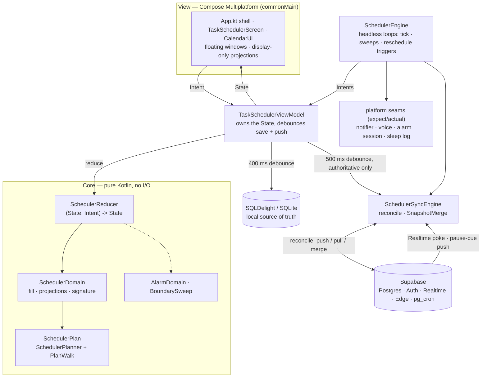

# OmniApp Global Architecture

> **What this file is.** How OmniApp is *built*: its components, how they talk to each other, and the reasoning behind the decisions that were expensive to reverse. It is not the product spec (`PRD.md` and `docs/PRD_TaskScheduler.md` own *what* the app should do) and not the day-to-day working rules (`CLAUDE.md` owns those). **Section numbers §1–§8 are cited from source comments and from other docs — extend them, but do not renumber them.**

## 0. System overview

OmniApp is a **Kotlin Multiplatform, offline-first personal scheduling app** (desktop-first, with Android, iOS and web targets). Its one implemented page, the **Task Scheduler**, holds a tree of tasks carrying priorities and minimum block sizes, and continuously answers one question — *what should I be doing now, and for how long* — by materialising a calendar of task blocks around the user's fixed commitments, on-screen / no-screen periods, eye-care **screen breaks**, alarms and sleep. Devices signed in to the same account converge on one document and cover for each other: when the whole account goes idle with a break due, the server asks whichever device is still reachable to speak the cue.

Four properties drive most of what follows:

| Property | Consequence throughout the codebase |
| --- | --- |
| **The plan is a pure function** of the rules and an instant | Scheduling runs on a **rule change**, never on the clock (§3). Time passing may only *consume* the plan. |
| **Offline-first** | The local SQLite database is the source of truth; the server holds a mirror (§4, §8). Every feature must work with no network. |
| **Only irreducible data is persisted or synced** | Anything recomputable is recomputed instead (§4, §8.1). This is what stops an always-running device from writing to the server all day just from time passing. |
| **Headless correctness** | Notifications, voice cues and alarms must be right on a phone whose UI is not running (§9), so they live in the engine, never in Compose. |

### 0.1 The shape of a running app

### 0.2 Components and what each one owns

| Component | Lives in | Owns | Must not |
| --- | --- | --- | --- |
| `SchedulerState` | `scheduler/state/SchedulerState.kt` | The entire immutable truth: task tree + named alternative trees, the default sub-tree template, calendar panels, completed-work records, chores/reminders, alarms, sleep schedule, settings, Undo/Redo history units, and local-only view state. | Hold anything derivable (§4). |
| `SchedulerIntent` | `scheduler/state/SchedulerIntent.kt` | Every user action *and* every engine event, as data. Its `syncsToServer()` draws the authoritative/derived line the whole sync model rests on (§8.1). | — |
| `SchedulerReducer` | `scheduler/state/SchedulerReducer.kt` | The single place state changes: `(State, Intent) → State`, pure and synchronous. Returns the *same instance* for a no-op, so a tick cannot churn storage. | Perform I/O, read the clock on its own, or touch Compose. |
| `SchedulerDomain` | `scheduler/domain/SchedulerDomain.kt` | Pure planning and projection: `fillSchedule` (the driver), screen-break and sleep projection, inactivity derivation, `schedulingSignature`, the cue due instants, display transforms such as sleep carving. | Depend on the ViewModel, the store or the network. |
| `SchedulerPlan` | `scheduler/domain/SchedulerPlan.kt` | The scheduling **model** itself — `SchedulerPlanner` + `PlanWalk`, a port of the Python reference in `side-dev/`. The **only** copy of the pick / chunk / influence-field rules (§3). | Be duplicated: `fillSchedule` is a driver over it, never a second implementation. |
| `AlarmDomain`, `BoundarySweep` | `scheduler/domain/`, `scheduler/engine/` | Pure boundary mathematics: which fixed instants the clock crossed, in order, and whether a crossing is still fresh enough to act on (§9). | Sample "where is the now-line now" as a substitute for crossing detection. |
| `TaskSchedulerViewModel` | `scheduler/ui/` | The seam between purity and the world: holds `_state`, dispatches intents, debounces the local save (400 ms) and the sync push (500 ms), watches account changes. | Contain scheduling logic. |
| `SchedulerEngine` | `scheduler/engine/` | Everything time- or platform-driven, headlessly: the advance tick, the cue and alarm sweeps, the reschedule triggers, presence, diagnostics (§9). Runs with no UI at all (Android foreground service). | Re-plan continuously (§3). |
| `SchedulerStore` / `SqlDelightSchedulerStore` / `SchedulerStateCodec` | `scheduler/persistence/` | Local persistence, schema migrations, JSON encode/decode, the `syncFingerprint` (the authoritative projection), and **healing** of states that older builds wrote (§4). | Surface a legacy shape as a live anomaly instead of repairing it. |
| `SchedulerSyncEngine`, `RemoteSnapshotClient`, `RealtimeSnapshotSubscriber`, `SnapshotMerge` | `scheduler/sync/` | Accounts, the mutex-guarded `reconcile()`, the three-way merge, the Realtime subscription (§8). | Push anything derived. |
| `DeviceHeartbeatPublisher`, `PauseCueGateway` | `scheduler/sync/` | The presence tick and the two pause-cue Edge Function calls (§8). | Carry schedule-dependent data on the tick (§8.1). |
| UI | `App.kt`, `scheduler/ui/TaskSchedulerScreen.kt`, `ui/CalendarUi.kt`, `ui/{Alarm,Sleep,TaskTrees,DefaultSubtree}Window.kt`, `ui/TaskSheetChrome.kt`, `ui/TimeSimPanel.kt` | Rendering, gestures, floating windows, and the **display-only** projections bounded by the visible week (§3). `TaskSheetChrome.kt` is the **one** copy of what a task-tree row looks like — the task tree and the default-sub-tree template both draw through it. | Decide anything, or store anything. Hold a second palette or indent step for a tree row. |
| Platform seams | `scheduler/platform/*`, `time/AppClock.kt`, `scheduler/debug/TimeLink.kt` | `expect`/`actual` access to notifications, speech, alarms, clipboard, OS session state, the OS sleep log, and the injectable clock (§10). | Grow logic — the `actual`s are adapters. |

### 0.3 The primary flows

1. **A user edit.** UI → `viewModel.dispatch(Intent)` → `SchedulerReducer.reduce` → a new `State` → recomposition. Two debounced tails follow: **400 ms** to SQLite, and — only if the intent is authoritative *and* the `syncFingerprint` actually moved — **500 ms** to `reconcile()` (§8.1).
2. **Time passing.** The engine's advance tick banks elapsed work as records (`AdvanceSchedule`) and materialises past sleep/inactivity. It does **not** re-plan (§3).
3. **A rule change.** Any edit that moves `SchedulerDomain.schedulingSignature` → 1 s debounce → `RefreshSchedule` → `fillSchedule` → new panels. Panels are derived, so they are stripped from the wire and every device regenerates its own.
4. **A remote edit.** Supabase Realtime pokes `reconcile()` → pull or three-way merge → the result is written straight into `_state` (never through `dispatch`), which moves the signature and re-plans locally.
5. **A boundary crossing** — a screen break falling due, an alarm, the end of a break: an engine sweep detects the crossing and calls a platform seam (§9).
6. **Display derivations** — Inactivity bands, carved sleep, break markers, alarm markers, far-week schedules — are recomputed per render in `App.kt`, bounded by the focused week, and never stored or synced (§3).

### 0.4 Where the rest of the system lives

| Path | Role |
| --- | --- |
| `shared/src/commonMain` | Nearly all of the app: domain, state, persistence, sync, engine and Compose UI. |
| `shared/src/{jvm,android,ios,wasmJs,js}Main` | The `actual` halves of the platform seams (§10), plus Android's service/receiver shell. |
| `desktopApp`, `androidApp`, `iosApp`, `webApp` | Thin entry points: set `DebugFlags`, build the ViewModel, host the shared UI. |
| `supabase/` | The server half: SQL migrations, the two pause-cue Edge Functions, the pg_cron setup (§8). |
| `side-dev/` | The Python **reference implementation** of the scheduling model and its test corpus — the authority `SchedulerPlan.kt` is verified against (§3). |
| `scripts/` | Windows dev/deploy entry points (per-account launches, Supabase deploy, diagnostics collection) — documented in `README.md`. |

## 1. Architectural Pattern: MVI (Model-View-Intent)
OmniApp utilizes a strict unidirectional MVI architecture. This ensures predictable state management across complex, highly interactive UIs like the Task Scheduler.

* **Model (State):** Immutable data classes representing the absolute truth of the UI. State is held in shared ViewModels.
* **View (Compose):** Stateless, declarative Compose Multi-platform functions. The View observes the State and renders it. It has no decision-making power.
* **Intent (Action/Event):** User interactions (clicks, typing, keyboard shortcuts) are dispatched as Intents to the ViewModel. The ViewModel processes the Intent, executes business logic, and emits a new immutable State.

## 2. Kotlin Multi-platform (KMP) Structure
The codebase follows a "Shared UI, Native Shell" philosophy.

* `shared/commonMain`: Contains 95% of the code. This includes the Domain logic, local database interactions, MVI ViewModels, and the Compose Multi-platform UI.
* `shared/[platform]Main`: Contains `expect`/`actual` implementations for platform-specific APIs (e.g., file system paths, platform-specific thread dispatchers, or lifecycle hooks).
* `[Platform]App`: The lightweight entry points. 
  * `desktopApp`: The primary JVM execution environment.
  * `androidApp`: The Android wrapper (MainActivity).
  * `iosApp`: The SwiftUI wrapper (hosting the Compose UIViewController).
  * `webApp`: The WASM/JS entry points.

## 3. Desktop-First Execution
OmniApp prioritizes Desktop interactions first. 
* Mouse events (hover, drag, right-click) and keyboard modifiers (`Ctrl`, `Shift`, `Tab`) are handled via Compose Multi-platform's `PointerEvent` and `KeyEvent` APIs in `commonMain`.
* When porting to touch interfaces (Android/iOS), adapter logic maps touch gestures (long-press, swipe) to the underlying MVI intents originally designed for mouse/keyboard.
* **The scheduler runs on a rule change, never on the clock (PRD §9).** The plan is a function from an instant to a task, so time passing must only *consume* it. `SchedulerDomain.schedulingSignature(state)` is everything the plan depends on except `now` — the tree and its priorities, minimum times, screen switches, the panels the fill treats as input (pinned/manual blocks, no-screen and inactivity periods), the sleep schedule, the screen-break configuration, and the §7 switch. `SchedulerEngine.launchRuleChangeReschedule` watches it on a 1-second debounce and is what re-plans (`RefreshSchedule`); a remote user's edit lands in the same flow, since a pulled snapshot is written straight into `vm.state`. On top of that sits one **staleness bound**, `SchedulerEngine.launchStaleReschedule`: a plan that has stood for `SCHEDULE_STALENESS_MILLIS` (1 h) without being re-planned is re-planned anyway. It is a bound, not a tick — every re-plan re-arms it (`requestReschedule`), so an account being edited never reaches it and a quiet one costs one fill per hour. Everything else time-driven is strictly weaker: the advance tick only banks records (`AdvanceSchedule`), and both the rolling horizon and calendar navigation **extend** the plan's tail (`ExtendSchedule` → `fillSchedule(keepExistingUntilMillis = …)`), keeping the materialized head and feeding it to the walk as committed service. The pick rule itself is the cyclic proportional-share model of `side-dev/README.md` (`SchedulerPlan.kt` — `SchedulerPlanner` + `PlanWalk`, a port of the reference implementation in `side-dev/`: `scheduler.py` holds the model and its own README-clause checks, `test_configs.py` the shape of the one editable test, `tests_displayer.py` the runner and the GUI that writes it): a Weighted-Fair-Queuing virtual clock picks the most starved task, and one influence field compensates a task for every way it can be deprived of the timeline — a block owned by someone else and a period that bans it are the same event, and the compensation decays exponentially with the distance to it. `fillSchedule` is only a driver over that walk, mapping OmniApp's pinned panels onto its pre-placed blocks and its screen zones / screen breaks onto its periods — a no-screen period accepts only the tasks needing no screen, the 20-s look-away accepts nobody, and the two rest poses are deliberately different shapes — the 5-minute one is a closed first minute followed by a tail accepting the tasks that need no screen *and* are marked doable during a break, while the 15-minute one is a single open period accepting every off-screen task from its first second, with no closed head and no break-doable gate (PRD §8/§9/§15). It replaced a debt-with-a-natural-bound model and, before that, an Earliest-Deadline-First fill.
* **Schedule computation is bounded by the screen and never blocks it (PRD §9).** The §9 fill is O(horizon), so the horizon is not a constant: `App.kt` publishes the calendar's focused week to the engine (`SchedulerEngine.setCalendarHorizon`), which drives `SchedulerReducer.scheduleHorizonEndMillis`, so every refill materializes the plan out to **the displayed week** — clamped into `[24 h, 168 h]` (a floor for the headless notification/cue paths with the calendar closed; a ceiling so a far week never enters stored state). Sitting on the current week computes no later day. A week past the ceiling is filled **for display only**, on `Dispatchers.Default` behind a "Calculating…" hint, and discarded on navigation — the UI thread never runs a multi-week fill, and no multi-week schedule is retained.

### 3.1 The two sanctioned exceptions to "time never re-plans"

Only two things are allowed to make the plan a function of the clock, and both are **quantised** so that what the rule really forbids — a continuously-changing input churning the plan every tick — still cannot happen.

* **The staleness bound** (above): a plan that has stood an hour is re-planned once. A bound, not a tick.
* **The task-tree timeline.** Alternative task trees can be given dates, at which point they become **priority keyframes**: between two of them the scheduler interpolates each task's priority linearly, so the plan transforms evenly from one arrangement into the next instead of snapping over on the date. By the user's specification the plan here genuinely *is* a function of time, so a plan computed once would be wrong from the next instant. `SchedulerEngine.launchTaskTreeBlendReschedule` samples the blend cursor every 60 s but dispatches only when a **quantised** step is crossed — 100 steps per transition, which bounds the priority error at 1 % and caps a whole transition at about a hundred fills however long it lasts. When no tree is dated the step is a constant, so an account that never uses the feature dispatches nothing at all. Task identity across keyframes is the `TaskId`, a task absent from one keyframe is 0 % there (which is how a task fades in or out), and the placeable set is the **union** of both keyframes — otherwise a continuously-changing priority would still produce a discontinuous plan.

A third case looks like an exception and is not: a **screen break that slides** along the now-line. The occurrence moves because the break is still owed, but the underlying rule has not changed, so nothing is re-planned — `App.kt` re-projects the markers for display and `SchedulerDomain.clipPlanForPinnedScreenBreak` cuts the regenerable panels out of the break's span as a **display** transform. In the reference model (`side-dev/`) this is the simplest case of a sliding period, and the app answers it with a clip rather than a per-tick fill.

## 4. Local Persistence & Offline-First
OmniApp is entirely offline-capable.
* **Framework:** Local database operations utilize a multi-platform SQL wrapper (SQLDelight); the desktop target uses the SQLite JDBC driver, web targets fall back to browser local-storage.
* **Load + debounced save:** State is loaded from the database once at startup; while running, the in-memory MVI State is the single source of truth. Every mutation updates that State immediately and is written back to the database on a small debounce (the store is not a reactive `Flow` source — the ViewModel does not collect DB queries live).
* **Continuous Sync:** All mutations (including Undo/Redo history units, stored one row per unit) are saved to the local database on that debounce, with a flush on close, to minimize data loss on unexpected exits.

## 5. History Architecture (Undo/Redo Engine)
The Undo/Redo mechanism operates on **Delta-based `HistoryUnits`** kept in one shared, persisted timeline (see §4 and `docs/PRD_TaskScheduler.md` §6 for the authoritative spec).
* Instead of saving full state snapshots (which would cause memory bloat with an infinite tree), the engine stores `HistoryUnits`.
* A `HistoryUnit` carries a `Delta` that is applied to move the state forward/back and inverted for the opposite direction, so the same unit serves both undo and redo.
* The timeline is **grouped into categories** (Edit Mode, Selection, Calendar, Main "the rest", Window-nav), **each with its own pointer** that walks only its own units — there is no single global pointer.
  * `Ctrl + Z` / `Ctrl + Y` walk the category of the **currently focused window** (the tree's edits, or the focused floating window's — e.g. the calendar's).
  * `Alt + Left` / `Alt + Right` walk the **selection-state** changes (task tree only).
  * A new mutation immediately discards the `HistoryUnits` ahead of that category's pointer (branch truncation).

## 6. Testing Strategy (TDD)
Behavior-Driven Development (BDD) and Test-Driven Development (TDD) are strictly enforced, focusing entirely on state mechanics.

* **ViewModel State Testing (Primary):** No UI code is merged without passing tests for the MVI Intent-to-State transitions. 
* **Scope:** Tests must validate selection mechanics, tree nested logic, and history delta generation entirely in memory using Kotlin's `runTest` API.
* **Target Execution:** Core tests reside in `shared/commonTest`. These same tests are executed across all platform targets (JVM, iOS Native, Wasm/JS) via Gradle to guarantee the state engine compiles and runs flawlessly on every architecture.
* **UI Testing:** Compose Multi-platform UI testing (e.g., verifying pixel-perfect rendering or semantic nodes) is deferred. The current mandate is to test the *State*, allowing the UI to remain a simple, stateless reflection of that data.
* **Manual testing:** Behaviour the automated suite cannot reach — real persistence, cross-device sync convergence, presence, OS-scheduled push cues, the background service, per-account isolation — has a step-by-step release checklist in `docs/MANUAL_TESTING.md` (keyed to the `scripts/account*` entry points; subsystem detail delegated to `docs/PAUSE_CUE_DELIVERY.md`).

## 7. Debug Tooling
Debug tooling exists to *exercise the real app under controlled conditions*, never to replace its logic. **Mandate:** any debug control that simulates an event (time passing, a device sleep, etc.) must drive the **same Intents and code paths** the production app uses for that event — it may differ only in the *source* of the trigger; downstream handling must be the production logic, shared, not copied. Controls are gated by `DebugFlags`, set once at startup from the platform entry point and **off by default**, so a packaged/release build never shows the debug tooling. The desktop dev `run` task enables it via the `omniapp.timeSim` system property; `createDistributable` (release) does not, so it ships off.

This is currently realized only by the Task Scheduler's time-simulation panel; its behaviour is specified in `docs/PRD_TaskScheduler.md` (§16).

## 8. Cross-Device Sync, Live Activity & Push Delivery (pg_cron heartbeat model)

### 8.0 Accounts: the app is always connected to one (PRD §5)
There is **no signed-out mode**. A device that has no account creates a **guest account** — a real Supabase account created through GoTrue's **anonymous sign-in** (`POST /auth/v1/signup` with an empty body), which therefore has no email and no password, so no other device can ever sign in to it. Everything else about it is ordinary: its own `scheduler_snapshot` row, its own presence/break/push rows, its own RLS scope. `SchedulerSyncEngine.ensureAccount()` creates it at startup and at the head of **every** `reconcile()`, so a first launch that is offline (or a project where anonymous sign-ins are still disabled) just keeps working locally and retries at the next sync moment. This requires **`enable_anonymous_sign_ins`** on the project (`supabase/config.toml`, or the Dashboard toggle) — `supabase db push` does not apply auth settings.

* **"Create an account" CLAIMS the guest account, it does not make a second one.** `createAccount()` on a guest issues `PUT /auth/v1/user` with the email + password — the same call Supabase's own clients use to convert an anonymous user — so the user id, the data, the devices and the remote rows are all unchanged; only the credentials appear. Nothing is copied, so nothing can be lost in the copy. (Needs email confirmation disabled on the project, which the account scripts already require.)
* **Sign-out lands on a fresh guest account** (`signOutToGuest()`), never on "nothing"; so does a remote force-logout (`account_logout`), *after* the reconcile that honours it has pushed nothing to the account being left.
* **Local data is partitioned per account** (schema v9, `8.sqm`): `app_state`, `history_unit` and `history_pointer` are keyed by `account_id`, and `SqlDelightSchedulerStore` reads/writes only the active account's partition (`sync_meta.user_id`). Switching accounts therefore **deletes nothing** — the account being left keeps its local copy and gets it back verbatim on a later sign-in — and no data can smear from one account into another. Data written before any account existed sits in the `''` partition, which the first guest account **adopts**.
* **The revision baseline is per account too** (`account_sync`). It is an optimistic-concurrency baseline against one account's row: carried across a switch, whole-document LWW would push this device's data over the other account's snapshot (or silently ignore it). `saveSyncMeta` therefore refuses to copy the bookkeeping in hand onto a *different* account; the account being entered keeps its own.
* **Device-level facts stay device-level.** The device id, the OS-sleep scan checkpoint, window placement and the recorded **active sessions ("screen time")** are properties of the install, not of an account, and a switch leaves them untouched. (Consequence to know: peer rows pulled from a previous account's other devices also remain in the local `device_active_session` table; they are re-pullable data, not user data.)
* Client: `SchedulerSyncEngine` (`AccountInfo`, `ensureAccount`, `createAccount`, `signOutToGuest`, `account` StateFlow) → `TaskSchedulerViewModel.watchAccountChanges` (swaps the local partition, re-points the Realtime subscription, reconciles once) → `SyncUi` (the chip reads "Guest" until the account is claimed). Tests: `SchedulerSyncEngineTest` (guest creation, claim-not-recreate, sign-out-to-guest, force-logout→guest), `SchedulerStoreTest` (per-account partitions + baselines, v8→v9 migration, unclaimed adoption), `TaskSchedulerAutoLoginTest` (scripts sign in instead of creating a guest).

### 8.1 Sync model
Cross-device sync is **offline-first**: the local SQLite database (§4) stays the source of truth and the server holds a mirror. The backend is **Supabase** (Postgres + Auth + Realtime + Edge Functions); the client talks to PostgREST / GoTrue over HTTPS for its writes, holds **one** Realtime WebSocket (the snapshot auto-pull) while signed in, and writes an activity **heartbeat row** while in use. This supersedes both the earlier "five sync moments" REST-only design and the intermediate **Realtime-presence + external Fly.io `/listener`** model (removed 2026-07-23): pg_cron cannot read Realtime Presence, but it can poll a `device_heartbeat` table — which is what the listener was doing internally anyway (a heartbeat + a 10-s tick), so the always-on worker was dropped in favour of a `tick_pause_cues()` cron. Retired machinery from the older designs (`derive_pauses` RPC, `device_presence`, last-phone-only cue) stays retired.

* **A presence table is the activity signal, written on a `t_a` tick and polled every `t_b`.** While a device is unlocked + signed in it calls the `publish_presence` RPC every **`t_a`** (`DeviceHeartbeatPublisher`), UPSERTing its row in the presence table (`device_heartbeat`) with exactly `{ user_id, device_id, beat_at }` — the time being **server-stamped**, never the client clock — and, in the **same call**, UPSERTing the account's `data_payload_sent` row back to `false`. Since migration `20260726000000` the beat is **identity + time and nothing else** (the device id is the entire request body); migration `20260728000000` then moved the claim flag off the presence row into its own account-keyed `data_payload_sent` table, since "has this idle episode already been pushed?" was always an account-level fact stored once per device. Everything that changes with the *schedule* (when each break comes due) lives in the separate, event-driven `device_break` row, so no per-beat payload can go stale between beats. `t_a` is **10 s by default and per-account, changeable over HTTP** (`app_config.tick_seconds`): the RPC returns the current value, so every device re-paces itself within one tick at no extra request. Because the tick runs only while the device is *actively unlocked*, its battery cost is negligible; on the free plan it is DB write traffic (not Realtime messages, not Edge invocations), fine for a handful of devices. Platform rules for "in use":
  * **Desktop:** the app is running, signed in, and the OS session is unlocked (`DesktopSessionTracker`, JNA session notifications).
  * **Android:** a **foreground service** (started at boot by `BootReceiver`) keeps the engine alive headlessly; at **first startup** the app asks the user **once** to disable battery optimization and enable autostart. Lock/unlock events (`AndroidUnlockTracker`) gate whether the device counts as active. *(Implementation status: the current build also uses `AndroidForegroundTracker` one-minute leases for the resume poke.)*
  * **The first beat is at LOGIN, not at the next activity beat.** The engine's per-device activity beat runs at 30 s, so a sign-in used to wait up to that long before the presence row first appeared. The sync-moment stream carries every reconcile — including the one a sign-in performs — so the engine samples the activity beat on the signed-out→signed-in **edge**, which starts the `t_a` loop and publishes the break dues immediately. Edge-triggered, so an ordinary reconcile costs nothing.
  * **Event-driven, with the tick as the backstop.** A screen-**off** event stops the tick and calls the `pause-cue` Edge Function (e1) directly (below); a screen-**on** event resumes it; a restart after a kill checks whether the device is locked and resumes the tick if it is not. The periodic tick exists precisely for the case that event-driven path cannot cover — the app killed abruptly, where the row simply goes stale.
* **A device is associated to exactly ONE account (migrations `20260727000000` + `20260728000000`).** The device id is allocated once per *install* and survives a sign-out, so signing out of A and into B used to strand A's presence + break rows: A read as permanently idle and, if its leftover break was overdue at that last beat, the next `t_b` tick pushed a **spurious cue** to A's phones. A `before insert or update` trigger on `device_heartbeat` now deletes any presence row for the same `device_id` under a different `user_id` (mirroring `20260721000000`'s push-token rule; SECURITY DEFINER, since the cross-account cleanup must bypass RLS), and any account thereby left with **no presence rows at all** also loses its `device_break` + `data_payload_sent` rows — those are account-keyed since `20260728000000`, and an account with no presence row can never be evaluated anyway (the cron groups over `device_heartbeat`; `evaluate_pause_cue()` needs `max(beat_at)`), so this is hygiene on top of a protection the eviction already gives. Deleting is safe under the reconstructibility rule — the presence row returns on the next beat and the break row on the next publish, which the client forces on every inactive→active transition so an account switched back to is not left with a heartbeat but no break. It keys on the device id, so a reinstall (new id) still leaves orphans for the account-empty scripts to clear.
* **The next breaks are a SEPARATE, event-driven row (`device_break`, migrations `20260726000000` + `20260728000000`).** `publish_next_break(break_5min_due_ms, break_15min_due_ms)` holds **the account plus the scheduled time of apparition of both screen breaks**, and is written **only when the app calculates a different pair** — a device sitting at its desk writes it zero times — retried with backoff until it lands, because (unlike a beat) nothing re-sends it on its own. The row **persists through lock/kill and is never cleared**: the last pair published while active is exactly the state the user walked away in, which is what the cue is judged on.
  * **Account-keyed, not device-keyed, and it carries only the two due instants.** Both dues are `lastRest + interval` over the screen-break config, and both inputs are part of the *synced* authoritative state, so every device of an account computes the same pair — a per-device row stored N copies of one account-level fact and forced the server to re-do, across rows, a selection each client had already done locally. `device_id`, `kind`, `break_kind` and `break_len_ms` go with it: the kind is implied by which column the due sits in, and the **length is the server's** (`break_config.length_ms`, else the kind's 5/15-min default). One deliberate consequence: the debug fast-break knobs no longer shrink the cue delay by themselves, so the `*-fast-break.bat` scripts set `break_config.length_ms` for the account instead (`account_db_admin.py break-length`).
  * **Why it left the beat.** Riding the `t_a` beat made the server's copy only as fresh as the last sample: the engine resamples the window on its 30-s active-session beat, so a schedule edit that changed the next break took up to 30 s to reach the server, and a walk-away inside that window was judged on the **pre-edit** break — wrong kind, wrong length, wrong overdue verdict. The clean screen-off path hit this **by construction**: it calls e1 without sending a final beat, so the row e1 reads is necessarily the pre-edit one. Writing on change closes the gap; the smaller beat is a side benefit, not the motivation.
  * **`break_due_ms` is the pose's FIXED due instant (`lastRest + interval`), not its drawn start.** That is what makes an event-driven write possible at all: the drawn start is `maxOf(due, now)`, so an overdue pose's start rides the now-line and changes at every sample. It also puts the server on the same boundary the client's own rest-pose cue keys on. An already-due pose publishes the constant `ALREADY_DUE_MILLIS` (0) — the server only asks `due <= beat_at`, so any past value answers it and only a constant one avoids re-triggering writes; a still-upcoming due is converted to the REAL instant it is reached at (`realInstantFor`), so an accelerated debug clock never reports a sim-ahead instant against real wall-clock beats.
* **Snapshot sync is bidirectional and automatic (whole-document, three-way MERGE on a conflict).** All trigger paths funnel through the one mutex-guarded `SchedulerSyncEngine.reconcile()` (push-if-dirty / pull-if-remote-newer, versioned by `revision`):
  * **Concurrent edits on two devices are merged, not raced.** When the remote has advanced *and* this device holds unpushed edits, `SnapshotMerge` combines both over the **common ancestor** — the snapshot of `last_known_revision`, kept per account in `account_sync.base_payload` (schema v10, `9.sqm`). Additions from either side survive, an untouched deletion sticks, independent field edits to one task both apply; only a same-field collision needs a winner and the **remote** takes it (the value the account already agreed on, i.e. what the old policy did anyway). A deletion racing an edit keeps the edit, and the merged tree is then repaired through the editor's own `pruneDetachedTree`, so an unreachable resurrection is pruned all the same. The merge is applied locally **and pushed on top of the remote revision**, which is what makes the peer converge on it rather than keeping half. Whole-document **LWW survives only as the fallback** for the cases a merge cannot be attempted — no ancestor on record (a DB upgraded from v9, an account never yet synced here) or an undecodable snapshot — and it self-heals, since the pull it performs records an ancestor. Deliberately not merged: the **Undo/Redo history**, where the local stack is kept — a unit carries whole before/after tree snapshots, so interleaving two devices' stacks would build a timeline whose Ctrl+Z restores a tree that never existed and silently discards the merge. Tests: `SnapshotMergeTest` (the rules) + `SchedulerSyncEngineTest` (the reconcile wiring and the fallback).
  * **Startup check — every launch reconciles once.** `TaskSchedulerViewModel.init` reconciles in the restored-session branch, so the app never opens on a stale `revision`. This is a *separate* path from the account-change one below, because a restored session is **not** a change: `SchedulerSyncEngine._account` is seeded from the persisted `sync_meta` at construction, so `watchAccountChanges` filters its first emission out. Without it, the first thing to reconcile on a restarted device is the user's **first edit** — whose own auto-push fetch then finds the remote ahead and LWW-**pulls over that edit**, destroying it (observed 2026-07-28: two task cells deleted after a release deploy reappeared, the device having sat on revision 62 against a remote 63). It also flushes anything a previous session left `dirty`, and no-ops offline.
  * **Local → remote auto-push.** An authoritative edit persists to SQLite on the ~400 ms save debounce and, when it actually moves `SchedulerStateCodec.syncFingerprint`, `markDirty()`s the engine **and** emits on a `MutableSharedFlow` that `TaskSchedulerViewModel` collects with a **500 ms `debounce`** → `reconcile()` (pushes only the pending change). Derived/tick reschedules leave the fingerprint unchanged and so never enqueue a push (reconstructibility rule).
  * **Remote → local auto-pull (real time).** While signed in, `RealtimeSnapshotSubscriber` holds a Supabase Realtime **`postgres_changes`** subscription on this account's `scheduler_snapshot` row (the **only** live WebSocket the client holds now, authorized by the user JWT through the row's RLS). A server-side change (a peer pushed) **pokes `reconcile()`**, which pulls; the subscriber never trusts the event body. Requires the table to be in the `supabase_realtime` publication with `replica identity full` (migration `20260722000000`). Verified live 2026-07-28.
  * **…plus a catch-up on every (re)subscribe — streaming alone does not converge.** Realtime reaches only the sockets connected at the instant of the change and offers **no resume cursor**, so every disconnection (OS sleep, network blip, JWT-expiry rejoin) permanently hides whatever landed during it. The subscriber therefore reconciles when the channel reports it is streaming (`RealtimePhoenix.isPostgresSubscriptionReady`), making the stale window as short as the reconnect. Without it a device stays stale until the user's next edit — and that edit is then destroyed by the LWW pull its own push triggers.
  * **Manual Sync button** (`syncNow()`) remains as a force-now fallback. A **change of account** (guest created, sign-in, sign-out, force-logout) also reconciles on its own: it must load what that account holds, so `watchAccountChanges` re-points the subscription and reconciles once against the new account (§8.0).
  * **Echo prevention** is layered: the `revision` guard no-ops a device's own just-pushed change (remote revision already equals `lastKnownRevision`), a pulled snapshot is applied straight to `_state` (not via the edit path) and resets `lastSyncedFingerprint` so it never enqueues a push-back, and the 500 ms debounce coalesces bursts.
  * The wire payload is still the **authoritative projection** (reconstructibility rule, `CLAUDE.md`): regenerated panels and local-only view state are stripped (`SyncPayloadTest`); a puller regenerates the schedule and keeps its own view state. Covered by `BidirectionalSyncTest` (VM wiring) + `SchedulerSyncEngineTest` (reconcile semantics). *(Live-verification status: the `postgres_changes` WebSocket path is **confirmed working** against the real project (2026-07-28) — a row UPDATE reached a subscribed desktop and poked the reconcile; the "needs on-device confirmation" caveat now covers only the pause-cue push path.)*
* **Device connection history → derived no-screen periods.** A device's active sessions (its connection windows; `device_active_session`, with a `kind` column naming the device) are physical facts, so they are authoritative — pushed/pulled per-row inside the **same reconcile as the snapshot** (`SchedulerSyncEngine.syncActiveSessions`, at the tail of every `reconcile()`), so they ride *every* trigger listed above, not just the button: the startup check, an account change, the 500 ms auto-push after an edit, a Realtime poke, and the (re)subscribe catch-up. Over the pulled union of every device's windows each client derives, over the last 168 h, the **no-screen periods** — the complement of the union (PRD §8/§15): decorative calendar panels, the input to the screen-break seeding, carved around the nightly Sleep windows. **Manually added no-screen periods are user data and are never replaced by the derivation.** A **past no-screen period that covered a scheduled task** banks no record — the stretch becomes a **past inactivity period** (a real panel; the app "must not assume anything", PRD §9). There is no live peer-activity channel to other clients (nothing pushes sessions on a timer, and Realtime carries only the snapshot row), so peers learn of activity at their **next reconcile** — in practice within seconds of either side's next edit or peer push, and at the latest at the next launch, reconnect or button press. Two idle apps that neither edit nor restart can still sit on stale peer activity; that is the residual staleness, and pressing Sync collapses it.
* **A sliding break re-projects; it does not reschedule.** If devices are still active (fresh heartbeats) when a screen break was scheduled to start, no cue is fired and nothing is pushed: the break's drawn occurrence slides on the now-line (PRD §15 now-line clamp) and `App.kt` re-projects the break markers for display each tick. It does **not** re-run the §9 fill — time passing never re-plans (§3), so the task panels around the sliding break keep their places until the next rule change. The per-tick refill that used to do this was removed: it churned the entire work plan continuously while the user was away, and nothing needed it (the cues key on the poses' fixed due instants, not on the drawn panels).
* **Two detections, two Edge Functions (no external worker) — migration `20260729000000`.** The account can stop being present in exactly two ways, and each has its own function, differing only in what is *known* about the walk-away instant:
  * **Clean lock — `pause-cue` ("e1"), the function that DECIDES.** The device listens to the OS lock event, so at the instant its screen goes off it sends one HTTP request (its own user JWT; the account is the `sub` claim). That request *is* the walk-away, so the cue is **`now() + break_length`** — nothing is estimated. e1 calls `evaluate_pause_cue()`, which re-checks account-wide liveness (excluding the caller, whose row is necessarily still fresh), the Sleep/Work mode and the overdue break, and **claims** the episode by flipping the account's `data_payload_sent` row to `true`.
  * **Dirty kill — `pause-cue-cron` ("e2"), the function the CRON drives.** A phone that died sends nothing. `tick_pause_cues()` runs every **`t_b`** (1 min by default, scheduled in `supabase/pause-cue-setup.sql`) and does one **fast grouped query** over the presence table: an account whose every `beat_at` is as old as or older than **`2·t_a`**, whose `data_payload_sent` row is still `false`, that is **not** sleeping (`account_state`), and that had a break **overdue** at its last beat, is handed to e2 via `omni_edge_push` (pg_net, service role). **The cron made the whole decision**, so e2 does not re-decide: `claim_pause_cue()` claims and directly computes `break_length` and the cue instant **`t2 + break_length`, `t2 = max(beat_at) + t_a/2`** — the expected midpoint of the tick interval the device vanished in. Since `t2` comes from the server-stamped `beat_at`, `t_b` is *detection* latency only and never moves the cue.
  * Either way the function then sends a **high-priority DATA push (FCM/APNs) to all the account's phones**; the phone arms its own exact OS alarm and speaks (`onPauseCuePush` / `onPauseCueFire`), without the app being woken. Both claim with the same conditional update, so a lock report racing a tick pushes exactly **one** cue and a device coming back re-arms the next episode by clearing the flag on its next beat. `build_pause_cue(user, anchor)` is shared, so the two can never disagree on which break governs, its length, or what is spoken — only the anchor differs. Delivery itself (token lookup, FCM v1, APNs) lives in `supabase/functions/_shared/push.ts`, imported by both.
  * `break_length` and the spoken message come from `break_config` per break type (`5min_break` / `15min_break`, both **changeable over HTTP**), falling back to the kind's own 5/15-min duration — since `20260728000000` the client publishes no length at all.
  * **Only an OVERDUE break fires a cue (migration `20260725000000`).** The cue means "your pause is over", so it must fire only when the account went idle with a rest break actually DUE — the user walked away *to take* the break. `evaluate_pause_cue()` and the `t_b` tick pre-filter share one predicate, `overdue_break_at_last_beat()`: either published due `<= max(beat_at)` over the account's presence rows (+ a `t_a` clock-skew slack) — "was this break already due at the last moment we saw this account?". Walking away for lunch with both poses still 40 min out leaves only future due instants → **no cue**, and an account with nothing overdue is never even handed to e2 ("if none in the past, pg_net is not used"). Reference is the account's own newest `beat_at`, NOT the later cron `now()` — otherwise an *upcoming* break whose instant merely elapsed after walk-away would fire. Judging against the account-wide `max(beat_at)` is what lets the break row be account-keyed at all, and it matches how idleness itself is already judged.
  * **Which break** governs is decided **server-side** from the published pair (the client publishes both dues — `SchedulerEngine.restPoseDueMillisByKey`). The rule is unchanged in meaning: among the breaks already due at the last beat the **longest** governs, so being idle long enough to owe both a 5-min and a 15-min pose fires the message 15 minutes after the account went idle, since resting 15 min discharges the 5 min too. A future due instant is correctly **not** fired on. A pose that has never been **anchored** (`lastRestMillis == 0`) is not published at all — its `lastRest + interval` sits in 1970 and would read as permanently overdue, earning a freshly emptied account a cue it never took a break for.
  * **A clean screen-off short-circuits the wait**: the device stops its tick and calls e1 directly, so the cue is armed *and anchored* at the lock instant instead of up to `t_b + 2·t_a` later; the estimate `beat_at + t_a/2` exists only because the cron path never observes the walk-away, and adds up to ±`t_a`/2 of error where the lock instant is known exactly. Idleness is judged **account-wide** (`max(beat_at)`), never per row — one stale row while the user works at the other device is not a pause.
  * A device becoming active again while a pushed cue is still in the future gets a `cancel` on the next `t_b` pass (also e2's job), and `poseFinishEligible` is the last line of defence at fire time. That pass is likewise the backstop for the one thing the split gives up: e2 does not re-test liveness between the cron's scan and pg_net's asynchronous dispatch, since the cron's `having` clause *is* the decision.
* **Sleep/Work toggle → `account_state`.** The left-menu toggle (`SchedulerState.sleepingUntilMillis`, `SetSleepMode`) writes the account's mode to `account_state` immediately (`publishAccountState`) so `tick_pause_cues()` suppresses the cue while the user is deliberately away; it persists across restart until the scheduled wake passes (`SchedulerEngine.resolveSleepModeOnStartup`).
* **Event-driven + tick traffic**: event-driven REST is the reconcile (startup, account change, the auto-push after an edit, a Realtime poke or (re)subscribe catch-up, and the manual button — never a timer), the Sleep/Work `account_state` write, the phone's push-token registration (startup/foreground), the `publish_next_break` write when the two break dues change, the clean screen-off Edge-Function call, and the login force-logout check (`account_logout`) inside a reconcile. The one steady-state timer traffic is the `t_a` `publish_presence` RPC **while the device is actively unlocked** (a DB write; nothing at all while locked). The Edge-Function push (server→phone) is the only server→device channel besides the snapshot WebSocket. What the free plan meters is **egress** (bytes sent back) and Edge invocations, not the number of RPC calls — so the split above is a *correctness* fix, not a bandwidth one.
* **Verification status:** the client and the Supabase schema compile and the pure pieces are unit-tested (`RealtimePhoenixTest`, `SleepModeTest`, `PresenceTickTest`, `PauseCueGatewayTest`, `RestPosePresenceWindowTest`); the **live** paths (clean lock ↔ `evaluate_pause_cue()` ↔ e1 ↔ phone, and client `t_a` tick ↔ `tick_pause_cues()` ↔ `claim_pause_cue()` ↔ e2 ↔ phone) still need on-device confirmation against a real project — see `docs/PAUSE_CUE_DELIVERY.md` (the runbook for that verification).

## 9. The engine: time, boundaries, cues and alarms

`SchedulerEngine` (`shared/.../scheduler/engine/`) is where *time* and *platform events* become Intents. It is deliberately outside the UI: on Android it runs inside a foreground service started at boot, so every guarantee below holds with no window on screen and the app never opened.

**One rule governs everything in this section: a trigger is a function of which fixed boundary instants the clock crossed — never of where a sample happened to land.** Sampling "is the now-line inside the block right now?" is wrong twice over: a suspended process skips the sample entirely (the cue is silently lost), and a fast display tick re-answers `true` on every frame (the cue spams). `BoundarySweep` is the shared answer: it enumerates the crossings between the previous scan and this one, tiles consecutive scans so no interval is ever skipped, orders the crossings, and judges staleness only by a crossing's **real** age — so a clock jump or a resume from sleep fires each missed boundary once, in order, and swallows only what is genuinely too old to be worth saying.

| Loop | Cadence | What it does |
| --- | --- | --- |
| `launchAdvanceTick` | 30 s (1 s under time simulation) | Banks elapsed auto panels as completed-work records, materialises past sleep/inactivity. **Never re-plans.** |
| `launchRuleChangeReschedule` | 1 s debounce on `schedulingSignature` | The *only* rule-watching re-plan trigger (§3); a remote pull lands in it too, since a pull writes `vm.state`. |
| `launchStaleReschedule` | polled, bound of 1 h | A plan that has stood an hour without re-planning is re-planned. A **bound**, not a tick: every re-plan re-arms it, so an account being edited never reaches it. |
| `launchTaskTreeBlendReschedule` | 60 s poll, **quantised** to 100 steps per transition | The one sanctioned time-driven re-plan (§3.1). |
| `launchHorizonReschedule`, `launchCalendarHorizonReschedule` | polled / on navigation | Extend the materialised tail when the displayed week grows (`ExtendSchedule`, which keeps the head — extending is not re-planning). |
| `launchCueSweep` | tick cadence, `BoundarySweep` | Screen-break boundaries: a break falling **due**, and a conducted break **ending**. Both are posted as notifications; the spoken half additionally honours the voice switch. All break cues come out of this one sweep so they are spoken in boundary order. |
| `launchAlarmSweep` (non-phone) / `launchAlarmArming` (phone) | crossing-driven / OS-armed | §18 alarms — see below. |
| `launchActiveSessionTracking`, `launchScreenBreakSeeding` | 30 s | Records this device's activity windows and re-derives the account-wide pauses that anchor the breaks (§8). |

**Screen breaks (PRD §15).** A break is **owed** until something actually serves it, so its drawn occurrence slides along the now-line — which means the drawn start is *not* a fixed instant and nothing may key on it. Every cue therefore keys on the stable **due** instant `lastRest + interval` as a level test, de-duplicated on that due. Three events serve a break, and each is an event rather than an assumption: a look-away the app itself conducted end to end, a real pause at least as long as the pose that was owed when it began, and a pause past the look-away's qualifying threshold. The same distinction decides what stays drawn once it is **past**: only a break the app **conducted**, so only a look-away that ran whole (one cut short — the manual "Look away now" supersedes the run in progress — is erased, because the anchor is an END and moves only on completion). A pose draws nothing in the past: the pause it is recognized from is already on the calendar as itself. `docs/adr/0003-screen-breaks.md` carries the full rule set and the tests that pin it; `CLAUDE.md` carries the invariants.

**Alarms (PRD §18) — the platform split is about what each platform can promise, not about who may ring.** The alarm list is ordinary authoritative state, so it syncs to every device; what differs is delivery. A **phone** must ring with the app killed, which only the OS can guarantee, so it arms the soonest ring as an exact OS alarm (`AlarmManager`) and the receiver arms the next. A **desktop** app that is not running cannot ring at all, so there is nothing to arm and the crossing itself is the trigger — an ordinary `BoundarySweep` (60 s freshness, looser than the 2 s cue budget, because an alarm is worth hearing slightly late) that self-delays to the next ring so the 30 s tick cannot make every alarm 30 s late. Both platforms then share one fire path, so they ring, disarm and log identically. Deliberately **not** an Edge-Function push like the pause cue: an alarm's instant is known in advance, so local arming works offline and costs no server traffic — the pause cue needs the server only because its *timing* depends on cross-device presence (§8).

**The alarm sound is synthesised, not bundled** (`AlarmTone.loopPcm()`): one loopable Karplus–Strong arpeggio cycle rendered in `commonMain` and written repeatedly by both ringing platforms. It is deterministic, so tests can assert it; there is no packaged resource that could fail to load. The §15 voice cues take the opposite decision — pre-rendered WAVs in `composeResources/files`, played through the `playVoiceCue` seam — because they carry *spoken words*, which must not depend on a system TTS voice being installed.

**Diagnostics.** `scheduler/platform/Diagnostics.kt` appends a local-only, rotating timeline (engine start, every reconcile outcome, every derived-pause refresh, every notification posted and cue played — *including crossings swallowed as stale*, which is the evidence that the process was suspended when one happened). `scripts/collect-diagnostics.bat` merges the desktop and Android logs into one timeline. **It is the first tool to reach for on a calendar or sync anomaly** — faster and more reliable than asking what the calendar looked like. Note it records what the app *attempted*: a logged notification is not proof the OS displayed it.

## 10. External context: dependencies, seams and entry points

**Third-party runtime dependencies are few and deliberately boring** — the app is offline-first, so every one of them must be optional at runtime or replaceable per platform.

| Dependency | Used for | Notes |
| --- | --- | --- |
| Compose Multiplatform + Material 3 | All UI, on every target | The UI is stateless (§1), so it can be replaced per platform without touching logic. |
| SQLDelight (+ SQLite JDBC / Android / Native drivers) | Local persistence (§4) | Web falls back to browser local-storage. Schema and migrations live in `shared/src/commonMain/sqldelight`. |
| kotlinx-serialization / kotlinx-datetime / kotlinx-coroutines | State encoding, calendar arithmetic, all the engine loops | — |
| Ktor client (+ WebSockets, content negotiation) | Every server call: PostgREST, GoTrue, Realtime (§8) | Chosen over the official Supabase Kotlin SDK to keep one small, auditable HTTP surface across five targets. |
| JNA (desktop only) | Windows session lock/unlock notifications, OS sleep log | Feeds the activity signal (§8). |
| Firebase Cloud Messaging / APNs (server → phone) | The pause-cue data push (§8) | The only server→device channel besides the snapshot WebSocket. |
| Supabase (Postgres, Auth, Realtime, Edge Functions, pg_cron, pg_net) | The whole server half (§8) | Self-hostable; the client speaks plain HTTP + Phoenix WebSocket to it. |
| Piper TTS (optional, desktop, dev-time) | Regenerating the bundled voice-cue WAVs | Not a runtime dependency — the WAVs ship in the app. |

**Everything platform-specific goes through one `expect`/`actual` seam**, all of them small adapters:

| Seam | Provides |
| --- | --- |
| `platform/SystemNotifier.kt`, `platform/Voice.kt`, `platform/AlarmSound.kt` | OS notifications, spoken cues, alarm ringing (§9). |
| `platform/DeviceInfo.kt` | Device kind, whether the screen is active/unlocked, and the listener that reports a change — the activity signal behind presence (§8). *(Gap: the iOS implementation is still a hardcoded `false`.)* |
| `platform/SleepHistory.kt` | Reading the OS sleep/wake log, so a device that was suspended can reconstruct what it missed. |
| `platform/GlobalHotkey.kt` | Claiming the three system-wide chords (`Ctrl+Shift+Alt+A` "I'm away", `Ctrl+Shift+Alt+E` "Look away now", `Ctrl+Shift+Alt+Z` "Switch task") from the OS, so they fire while the app is not focused. On Windows the claim is a low-level keyboard hook that **swallows** the key — first come, first served — with `RegisterHotKey` underneath as the fallback; `docs/adr/0011-global-keyboard-shortcuts.md`. Inert on Android/iOS. |
| `platform/Diagnostics.kt`, `platform/SystemClipboard.kt`, `platform/DeadKey.kt`, `ui/PlatformCursor.kt` | Logging, clipboard, keyboard and cursor details. |
| `persistence/DefaultSchedulerStore.kt` | The per-platform SQLDelight driver (and the web fallback). |
| `sync/StartupLogin.kt` | The non-interactive credentials the `scripts/account*` entry points inject. |
| `platform/PauseCueLocal.kt` | Receiving the server's data push and arming the local cue on the phone (§8). |
| `debug/TimeLink.kt`, `time/AppClock.kt` | The injectable clock — real, or the simulated one the debug panel drives (§7). **All engine durations are read through it**, so time simulation exercises the production paths rather than bypassing them. |

**Human-facing entry points.** `./gradlew :desktopApp:run` (primary), `:shared:check` / `:shared:jvmTest` (the verification gates), and the `scripts/` batch files for per-account launches, Android deploys, Supabase deploys and diagnostics — all listed in `README.md`. There are two independent deployment surfaces and a change to one does **not** take effect in the other: **Supabase** (`deploy-supabase.bat`) and **the client apps** (a rebuild). A green test run means the code is correct, never that it is live on a device.

## 11. Design rationale index — where the "why" is written down

This project keeps its decision records inline rather than as a separate ADR directory; the reasoning for the load-bearing choices lives next to the rule it justifies:

| Decision | Rationale is in |
| --- | --- |
| MVI with one immutable state object; delta-based multi-pointer history | §1, §5, and `docs/PRD_TaskScheduler.md` §6 |
| Scheduling on a rule change rather than on the clock, and its two sanctioned exceptions | §3, §3.1 |
| The cyclic proportional-share model (virtual clocks + influence field) and its rejected predecessors (debt-with-a-bound, EDF) | §3, `side-dev/README.md`, and `docs/adr/0001-scheduler-model.md` |
| Persist/sync only what cannot be recomputed | §4, §8.1, `CLAUDE.md` ("State: authoritative vs. derived") and `docs/adr/0007-accounts-and-persistence.md` |
| Whole-document sync with a three-way merge, and why LWW survives only as a fallback | §8.1 |
| A pg_cron heartbeat instead of Realtime presence or an external worker; two Edge Functions instead of one | §8 (with the history of what was removed and why) |
| Local OS alarms vs. a server push for the pause cue | §9 |
| Debug tooling that drives production code paths only | §7 |
| Old on-disk shapes must be healed on load, not surfaced as anomalies | §4 and `CLAUDE.md` ("Persisted-DB compatibility") |

**Keeping this file honest.** `CLAUDE.md` is the fast-moving record of *invariants*; `docs/adr/` holds the reasoning and the regressions that produced them, and `CHANGELOG.md` the dated log (migration numbers included). It is normal for all three to be ahead of this file. This file is the stable one: it should change when a *component boundary, a data flow, an external dependency or a rationale* changes, and a change that makes any statement here wrong is not finished until the statement is fixed. The details that belong in `CLAUDE.md` / `docs/adr/` / `CHANGELOG.md` (exact constants, individual test names, migration numbers) are cited here only where they identify the mechanism, so that this document can stay readable end to end by someone who has not read the source.
